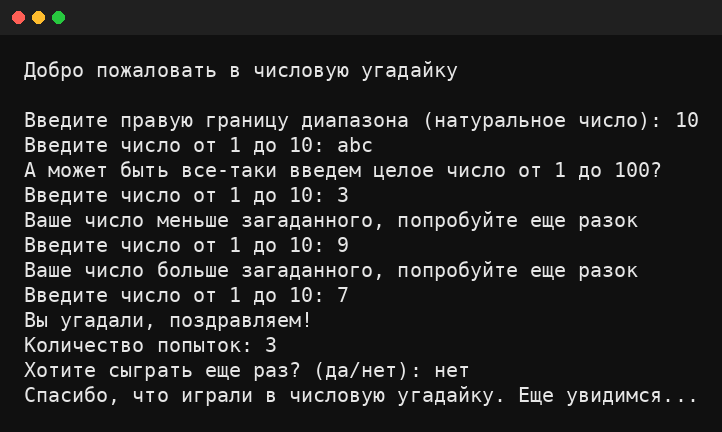

# Guess the Number — Числовая угадайка 🎯


## Учебный проект: консольная игра, где компьютер загадывает число, а пользователь угадывает.

## Demo



## Структура проекта

```text
guess-the-number/
├─ src/
│  └─ guess_the_number/
│     ├─ __init__.py
│     └─ game.py
├─ tests/
│  └─ test_game.py
├─ docs/
│  ├─ REQUIREMENTS.md
│  └─ USER_GUIDE.md
├─ .github/
│  └─ workflows/
│     └─ ci.yml
├─ .gitignore
├─ pyproject.toml
└─ README.md
```

## Требования (по ТЗ)
- Подключение `random`
- Случайное число в диапазоне `1..n` (правую границу вводит пользователь)
- Приветствие: `Добро пожаловать в числовую угадайку`
- Защита от неверного ввода (функция валидации)
- Подсчёт попыток
- Повторная игра после угадывания
- Прощание: `Спасибо, что играли в числовую угадайку. Еще увидимся...`

Подробное ТЗ: `docs/REQUIREMENTS.md`


## Запуск
```bash
python -m guess_the_number
```
или так (если запускаете файл напрямую):
```bash
python -m guess_the_number.game
```

## Тесты
python -m pip install -e .[dev]
pytest


## Идея архитектуры

Логика игры вынесена в функции с внедряемыми input_func/print_func, чтобы игру было удобно тестировать.

